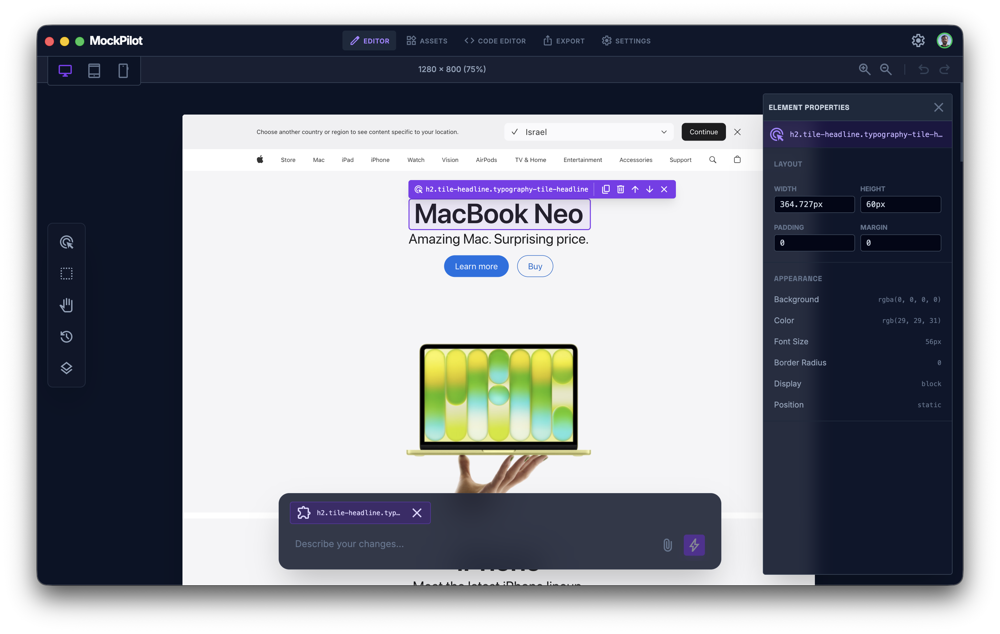
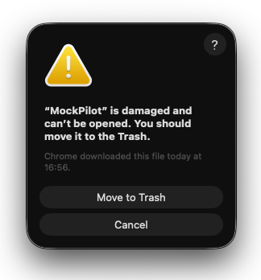
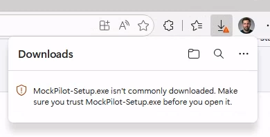

<div align="center">

# 

[](https://github.com/ykadosh/mock-pilot/releases)
[](https://github.com/ykadosh/mock-pilot/blob/main/LICENSE)
[](#installation)
[](https://github.com/features/copilot)

**Capture any webpage and turn it into an editable mockup — right on your desktop.**

[](https://github.com/ykadosh/mock-pilot/releases/latest/download/MockPilot.zip)
[](https://github.com/ykadosh/mock-pilot/releases/latest/download/MockPilot.exe)

</div>

---

MockPilot lets you capture live web pages, strip away the noise, and edit the result as a self-contained HTML mockup. Perfect for designers, product managers, and developers who need quick, realistic mockups without firing up Figma.

<div align="center">

</div>

## Installation

### macOS

1. Download `MockPilot.zip` from the latest [release](https://github.com/ykadosh/mock-pilot/releases) (or use the button above)
2. Unzip it and move **MockPilot.app** to your Applications folder
3. Since the app is not yet code-signed, macOS will block it on first launch with a "MockPilot is damaged and can't be opened" dialog:

   

   Click **Cancel** (do *not* move it to Trash), then run:
   ```bash
   xattr -cr /Applications/MockPilot.app
   ```
4. Open the app normally

### Windows

1. Download the `.exe` installer from the latest [release](https://github.com/ykadosh/mock-pilot/releases)
2. Since the installer isn't yet code-signed, Microsoft Edge / SmartScreen will warn that it "isn't commonly downloaded":

   

   In the Edge downloads bar, click the `•••` menu next to the warning → **Keep** → **Keep anyway**. (The file will be named `MockPilot.exe` in newer releases; older releases ship `MockPilot-Setup.exe`.)
3. When you launch the installer, Windows SmartScreen may show a blue "Windows protected your PC" dialog. Click **More info** → **Run anyway**.
4. Follow the installer prompts

---

## Development

### Prerequisites

- [Node.js](https://nodejs.org/) 22+
- npm

### Running locally

```bash
npm install
npm start
```

### Building

```bash
# Package the app (unpackaged)
npm run package

# Create distributable installers
npm run make
```

### Releasing

Releases are automated via GitHub Actions. Pushing a version tag (`v*`) triggers a pipeline that builds for macOS and Windows and publishes a GitHub Release.

```bash
npm run release:patch   # 0.1.0 → 0.1.1
npm run release:minor   # 0.1.1 → 0.2.0
npm run release:major   # 0.2.0 → 1.0.0
```

These scripts bump the version in `package.json`, commit, tag, and push — the release workflow takes care of the rest.

---

### Tech Stack

Electron · Electron Forge · Vite · React · TypeScript · Tailwind CSS · shadcn/ui
